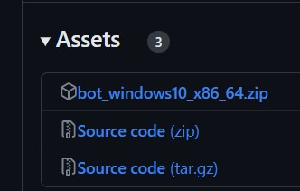

# A simple discord bot that just plays music

## Feature:

- Join the channel you're in
- Play from Youtube / Any platform supported by yt-dlp (also works with http streams)
- Song queue
- Pause and resume the song

## To do:

- Help command
- Some optimization until it runs smooth on a raspberry pi 3b

## Setup guide:
### For windows users:
If you are a normie who just wants to use the bot, you can download the compiled version with all it's dependencies from [releases](https://github.com/Omicron166/Discord-Bot/releases/latest) and run it.

  Also don't forget to put your token and prefix in `config.json`
### For Linux users:
- Install python 3
- Install ffmpeg
- Clone the repo
- Run a `pip install -r requirements.txt` or a `pipenv install -r requirements.txt`, pick your favourite option.
- Fill the `config.json`.
